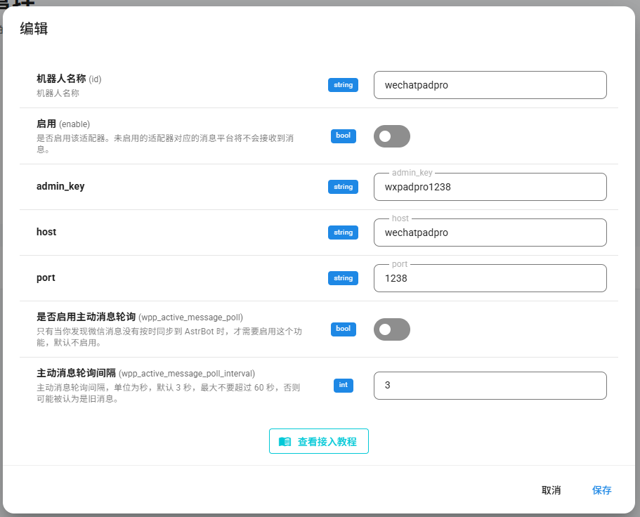

# AstrBot 一键部署说明

> 最近更新：2025-10-14
- 适配wechatpadpro最新861版本

## **本脚本仅适用于 Linux 环境下使用 Docker 部署**

## 快速开始
> 请确保已安装`docker compose`,机器可以连接到`Docker Hub`或已配置镜像源
1. 拉取本仓库：
   ```bash
   git clone --depth=1 https://github.com/railgun19457/AstrbotScript.git
   cd ./AstrbotScript
   ```
2. 赋予脚本执行权限：
   ```bash
   chmod +x ./AstrBot.sh
   ```
3. 运行一键部署脚本：
   ```bash
   sudo ./AstrBot.sh
   #或者使用
   #sudo bash ./AstrBot.sh
   #使用该命令可以略过第二部赋权
   ```
4. 按提示选择要部署的组件（可多选）：
   - AstrBot
   - NapCat
   - WeChatPadPro
   - 全部部署

## 组件说明

### AstrBot
- 容器名称：`astrbot`
- 面板端口：6185
- 默认账号/密码：`astrbot`

### NapCat
- 容器名称：`napcat`
- 面板端口：6099
- 默认密码：`见控制台`(新版napcat会在首次启动时生成随机密码)

### WeChatPadPro
- 主程序容器名称：`wechatpadpro`
- 管理面板端口：`1238`
- Admin_key：`wxpadpro1238`
- MariaDB 容器名称：`db_wx`
  - 用于替代 `mysql5.7`，大幅降低内存占用
  - 端口：容器内 3306（未对外映射）
  - 数据库名：`weixin`
  - 用户名：`weixin`
  - 密码：`wxpadprodb`
  - Root 密码：`wxpadprodbroot`
- Redis 容器名称：`redis_wx`
  - 端口：容器内 6379（未对外映射）
  - 密码：`wxpadproredis`

## 连接教程
- ### NapCat
  - 在AstrBot消息平台添加 `QQ个人号(aiocqhttp)`
  - 反向 Websocket 主机地址: `0.0.0.0`或 `astrbot`
  - 反向 Websocket 端口: `6199`
  - 反向 Websocket Token: 与NapCat中一致
  - 
  - 在NapCat面板中打开 `网络配置` 添加 `Websocket客户端`
  - URL: `ws://astrbot:6199/ws`
  - 消息格式: `Array`
  - Token: 和AstrBot配置中一致即可
  - 

- ### WeChatPadPro
  - 在AstrBot消息平台添加 `微信个人号(WeChatPadPro)`
  - admin_key: `wxpadpro1238`
  - host: `wechatpadpro`
  - port: `1238`
  - 

## 官方文档与仓库
- 官方文档：https://docs.astrbot.app
- 文档镜像站：https://doc.astrbot.misakanet.site
- AstrBot 仓库：https://github.com/AstrBotDevs/AstrBot
- NapCat仓库：https://github.com/NapNeko/NapCatQQ
- NapCat文档：https://napcat.napneko.icu
- WeChatPadPro 仓库：https://github.com/WeChatPadPro/WeChatPadPro

---

## 更新日志
- 2025-10-14：
  - 更新适配wechatpadpro 861版本
  - 升级脚本
  - 文档中添加连接教程
  
- 2025-07-10：
  - 完善文档结构，补充镜像站与仓库链接，权限处理逻辑优化，组件说明细化
  - 适配新版wechatpadpro
  - 将原本3个独立的脚本合成一个，添加目录检查和自动提权（提权仅针对redis/conf文件夹）
  - 脚本结构优化：部署逻辑全部内联到 case 分支，支持更灵活组合，网络创建步骤提前
  
- 2025-06-13: 
  - 首次提交，实现基本功能