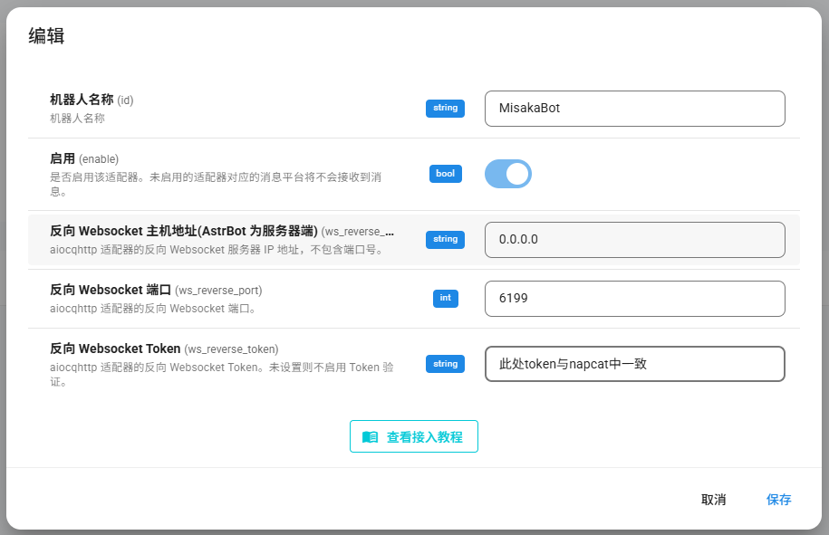
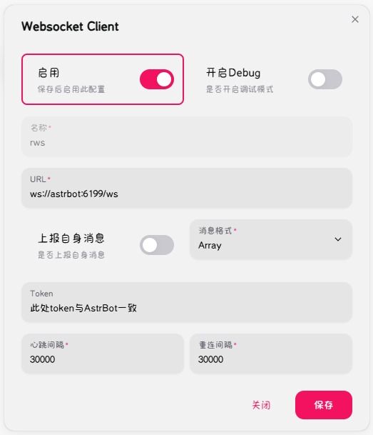

# AstrBot 一键部署说明

> 最近更新：2025-12-18
> - 脚本 2.1.0 移除wechatpadpro支持 优化管理功能


> [!note]
> 由于各种原因，之后不再维护WeChatPadPro部署，最后支持的版本可以去[wechatpadpro](https://github.com/railgun19457/AstrbotScript/tree/wechatpadpro)分支查看

## 兼容性
- 适用于 `Linux/WSL`
- 基于 `Docker` 部署

## 快速开始

### 拉取并运行脚本
   
   使用`curl`
   ```bash
    sudo curl -sSL https://raw.githubusercontent.com/railgun19457/AstrbotScript/main/AstrbotScript.sh -o AstrbotScript.sh
    sudo chmod +x AstrbotScript.sh
    sudo ./AstrbotScript.sh
   ```
  > sudo ./AstrbotScript.sh --no-color (可选禁用彩色输出)

  使用`wget`
  ```bash
   sudo wget -qO AstrbotScript.sh https://raw.githubusercontent.com/railgun19457/AstrbotScript/main/AstrbotScript.sh
   sudo chmod +x AstrbotScript.sh
   sudo ./AstrbotScript.sh
  ```
  > sudo ./AstrbotScript.sh --no-color (可选禁用彩色输出)

### 选择`安装并配置 Docker 环境`**(可选)**
   - 脚本会自动完成Docker安装和换源
   - 使用Linuxmirror脚本实现

### 修改 `环境设置`**(可选)**
   - 包含`安装目录`和`容器网络`
   - 默认安装目录`/opt/AstrBot`
   - 默认容器网络`astrbot`
   - Astrbot端口映射
   - NapCat端口映射
  
### 选择 `部署新服务`
   - 选择需要部署的服务
   - 每次可选一个选项，可多次选择
   - 选好需要的项目后，选择开始安装
   - 等待安装完成
  
### 后续管理
   - 可使用 查看服务状态 查看所有项目的运行状态
   - 选择对应的项目可以进行进一步管理
     - 启动容器
     - 停止容器
     - 重启容器
     - 查看日志
     - 升级容器
     - 删除容器和挂载文件夹

## 组件说明

### AstrBot
- 容器名称：`astrbot`
- 面板端口：6185
- 默认账号/密码：`astrbot`

### NapCat
- 容器名称：`napcat`
- 面板端口：6099
- 默认密码：`见控制台`(新版napcat会在首次启动时生成随机密码)

## 连接教程
- 在AstrBot消息平台添加 `QQ个人号(aiocqhttp)`
- 反向 Websocket 主机地址: `0.0.0.0`或 `astrbot`
- 反向 Websocket 端口: `6199`
- 反向 Websocket Token: 与NapCat中一致
- 
- 在NapCat面板中打开 `网络配置` 添加 `Websocket客户端`
- URL: `ws://astrbot:6199/ws`
- 消息格式: `Array`
- Token: 和AstrBot配置中一致即可
- 


## 官方文档与仓库
- 官方文档：https://docs.astrbot.app
- 文档镜像站：https://doc.astrbot.misakanet.site
- AstrBot 仓库：https://github.com/AstrBotDevs/AstrBot
- NapCat仓库：https://github.com/NapNeko/NapCatQQ
- NapCat文档：https://napcat.napneko.icu

## 特别感谢
- LinuxMirrors：https://linuxmirrors.cn 本项目的docker环境配置使用了他们的脚本

---

## 更新日志

- **2025-12-18 (v2.1.0)**：
  - 移除wechatpadpro支持
  - 优化管理功能
  - 支持自定义端口映射
  - 支持密码管理

- **2025-11-09 (v2.0.1)**：
  - 合并重复 start/stop/restart/rebuild/delete 逻辑为统一函数，减少维护成本
  - 新增 `--no-color` / `NO_COLOR=1` 关闭彩色输出（便于日志重定向）
  - Docker / Compose 检测与安装逻辑压缩为一段更安全的流程
  - 目录创建、依赖容器处理逻辑统一
  - 删除 wechatpadpro 时同步删依赖容器 (db_wx, redis_wx) 与数据目录
  - 版本号更新为 2.0.1
  
- **2025-11-09 (v2.0.0)**：
  - 彻底重构脚本实现, 不需要拉取任何额外文件，单脚本文件即可
  - 添加完善的管理功能
  - 添加自动配置 Docker 环境功能

- **2025-10-14**：
  - 更新适配wechatpadpro 861版本
  - 升级脚本
  - 文档中添加连接教程
  
- **2025-07-10**：
  - 完善文档结构，补充镜像站与仓库链接，权限处理逻辑优化，组件说明细化
  - 适配新版wechatpadpro
  - 将原本3个独立的脚本合成一个，添加目录检查和自动提权（提权仅针对redis/conf文件夹）
  - 脚本结构优化：部署逻辑全部内联到 case 分支，支持更灵活组合，网络创建步骤提前
  
- **2025-06-13**: 
  - 首次提交，实现基本功能